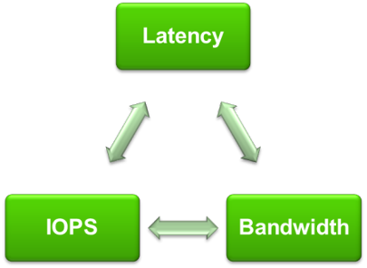
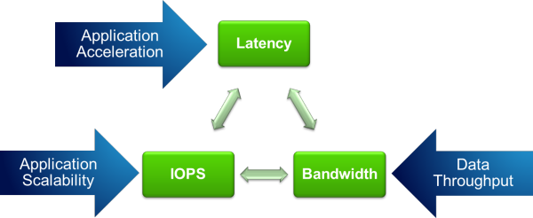

# Các yếu tố quan trọng trong Storage
---
## Tổng quan
3 yếu tố quan trọng của Storage là



`Latency` đo lường độ trễ của hệ thống, ở đây nó đại diện cho thời gian đáp ứng yêu cầu IO, độ trễ trung bình của 1 IO. Số liệu này đối với HDD thường được tính bằng millisecond, đối với SSD tính bằng microsecond. 

`IOPS` (I/O Per Second) tượng trưng cho số lượng hoạt động IO có thể diễn ra trong 1 giây. Số liệu IOP rất quan trọng trong các hệ thống lưu trữ, đặc biệt là số lượng và tính ngẫu nhiên. Khi đánh giá 1 thiết bị cần xem xét giá trị Mã IOPS, với kích cỡ, bản chất IO.

`Băng thông` (Bandwidth hoặc cũng được biết là throughput), giá trị đại diện cho khối lượng dữ liệu có thể xử lý trong 1 thời điểm - có thể hiểu cách khác, nó là lượng dữ liệu được truyền đến hệ thống mỗi giây. Số liệu được do thường tính theo đơn vị MB/s hoặc GB/s. IO Size có thể là 4KB, 8KB, 32KB, .. 


Throughput đơn giản là tích giá trình IOPS với IO size.
```
Throughput   =   IOPS   x   I/O size
```

VD:

```
VD: 2048 IOPS với 8k blocksize
Throughput = IOPS x IO size = 2048 * 8K = 16,384 KB/S

Giá trị Throughput tương đương 16 MB/S.
```

Latency cũng ảnh hướng tới hiệu năng, độ trệ hệ thống tăng khiến các tiến trình diễn ra chậm hơn. 

```
Latency   ∝   IOPS
```

Biểu thức trên thể hiện mối quan hệ trực tiếp dựa Latency với IOPS, độ trễ hệ thống sẽ tăng lên theo cấp số nhân khi dần tới điểm bão hòa.


Biểu đồ trên thể hiện ảnh hưởng giữa Latency với IOPS. Thời gian đáp ứng sẽ tăng lên nhanh khi số IOPS tới giới hạn. 

Latency là khoảng thời gian thiết bị từ thời điểm giải quyết xong 1 request tới thời điểm sẵn sàng bắt đầu tiến trình đọc ghi. Đối với ổ đĩa quay, độ trễ bao gồm thời gian đầu đọc chuyến đến dữ liệu cần tìm và độ trễ quay, cả 2 vẫn đề đều xuất phát từ quá trình cơ học.

Quan hệ giữ IO Size và IOPS, nếu các IO Size có kích thước nhỏ chúng sẽ tận dụng được nhiều IOPS. Các IO request lớn đồng nghĩa với sử dụng ít IOPS.
> Cả 2 đều cho tốc độ đọc ghi giống nhau

```
IO size = 4 KB, IOPS = 29600 
4096 x 29600 = 121 MB/s

IO size = 32 KB, IOPS = 3700
32784 x 3700 = 121 MB/s (IO size x IOPS)
```

Các truy cập ngẫu nhiên sẽ giảm khối lượng IOPS sử dụng cũng như throughput.

Ví dụ, 29000 IOPS, IO Size = 32KB = 121 MB/S, nhưng đây là giá trị truy cập tuần bị. Đối với truy cập ngẫu nhiên, ta phải sử dụng IO size (random) theo công thức:
```
IO size (random) x IOPS = Throughput

VD:
IO Size (random) x 245 = 0,96 MB/s
```

Từ đó cùng 1 loại ổ đĩa, tốc độ đọc ghi từ 121 MB/s giảm xuống còn 1 MB/s. Đó cung là lý do tại sao throughput không phải tham số quan trọng nhất trong 1 số trường hợp.

Ổ đĩa quay có tham số Revolutions Per Minute or "RPM". Thể hiện số vòng quay mỗi giây. Thông số này sẽ kéo theo tham số `Rotational Delay`, gọi là độ trễ quay. Các loại ổ cứng có tốc độ quay khác nhau sẽ có giá trị trễ khác nhau:


## App tương tác với Storage
Các App tương tác với Storage



`Latency` là hiệu năng ứng dụng. Nếu muốn cải thện trải nhiệm người dùng, muốn ứng dụng đọc dữ liệu nhanh hơn, .., độ trễ là rất quan trọng.

`IOPS` sẽ giúp giải quyết khối lượng công việc lớn nhanh hơn.

`Bandwidth / Throughput` đáp ứng khả năng truyền dữ liệu vào hệ thống. Đây là 1 vấn đề quan trọng trong các Data Center, nơi cần xử lý lưu trữ nhiều loại dữ liệu. Hoặc các DB tại mỗi thời điểm nào đó cần sử dụng băng thông đọc ghi rất lớn.

Trước đây, các giao dịch trực tuyến phụ thuộc rất nhiều vào thời gian phản hồi. Vì vậy các hệ thống có giá trị IOPS tốt sẽ xử lý các giao dịch trực tuyến nhanh. Nhưng đến hiện tại, vấn đề trở nên phức tạp hơn. 1 số cơ sở dữ liệu phụ thuộc vào việc truyền dữ liệu tuần tự (throughput), ảnh hưởng thời gian phản hồi IO đơn.

Mặt khác, high throughput góp phần quan trọng, đặc biệt khi nói đến khả năng truyền khối lượng lớn công việc tuần tự như truy vấn các file audio, video khối lượng lớn. Vì vậy, nếu throughput cao sẽ đáp ứng được khối lượng công việc cao hơn (càng nhiều MB/s càng xử lý được nhiều công việc)
